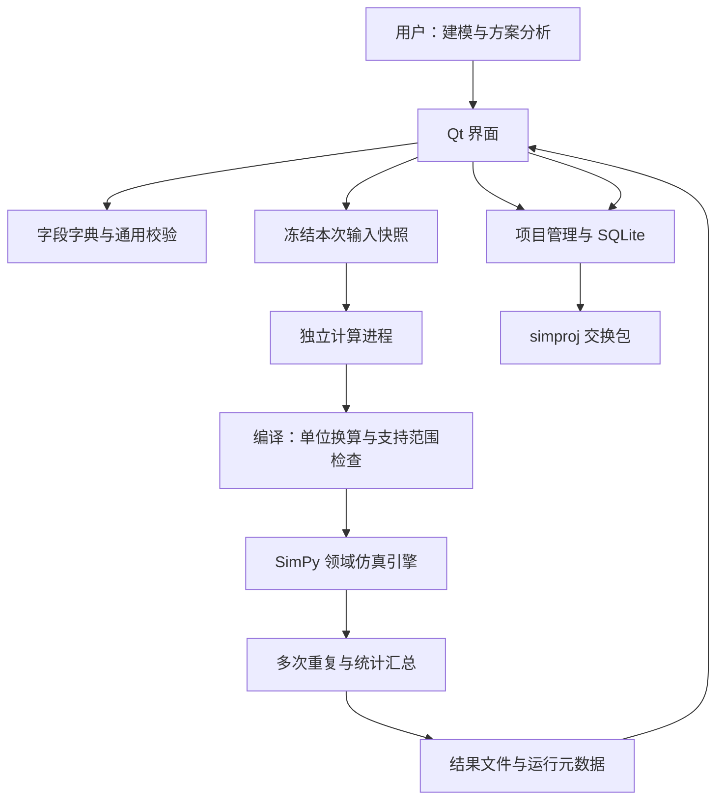

# 自制 SIMLOX 类软件：架构与交付方案

0.3 已增加 hierarchy.py、components.py、maintenance.py 以及明确独立的扩展表。进程架构不变，最新实现见 [V0.3.md](V0.3.md)。

本文保留 0.1 基线架构分析。当前 0.2 已增加固定任务需求窗口和维修班次，最新实现与限制见 [V0.2.md](V0.2.md)。

日期：2026-09-07。交付名称：SimLab 0.1.0，Windows 单机版。

## 1. 产品目标与范围

SIMLOX 的公开定位是通过离散事件仿真评估系统群及其保障体系随时间的运行表现。来源：[Systecon SIMLOX 官方介绍](https://www.systecongroup.com/gl/software/simlox-ensuring-performance)。以下为本项目自主设计，不是原厂内部架构说明。

自制软件首先要回答：给定设备数量、故障特性、维修资源、备件和运输时间，设备群能保持多少可用度，停机主要发生在哪里，调整保障方案后结果如何变化？

第一版落实“建模 → 校验 → 重复仿真 → 分析 → 方案对比 → 项目交换”。当前工作区已有这套实现，本次在现有成果上复验并补齐架构说明。字段编辑范围与计算范围分开管理：133 张输入表、891 个字段可编辑，不代表所有业务规则均可计算。

## 2. 架构选择

采用模块化单机应用，计算放入独立进程。Python 便于表达领域规则与检验模型；Qt 提供桌面表格和图表；SimPy 管理事件调度；NumPy 管理随机数及统计；SQLite 保存项目。第一版不需要常驻服务或服务器数据库。

进程隔离使计算期间界面能继续响应，取消也不必等待主线程仿真结束。领域引擎不依赖 Qt，未来可以通过命令行或服务端复用。模块之间现阶段使用 Python 对象和 JSON 文件即可，无需提前引入消息队列或微服务。

## 3. 模块责任与源码位置

| 模块 | 源码 | 责任 |
|---|---|---|
| 桌面入口 | `main.py` | GUI、worker、自动化检查三种启动模式 |
| 建模界面 | `simlab/ui/modeling.py` | 表格、字段说明、下拉引用、CSV 交换 |
| 工作台与结果 | `simlab/ui/window.py`、`widgets.py` | 项目操作、启动取消、曲线、历史对比 |
| 数据字典 | `simlab/schema.py`、`data/schema.json` | 字段类型、默认值、单位、约束及关联 |
| 通用校验 | `simlab/validation.py` | 非法数值、引用、组合键和结构循环 |
| 运行模型编译 | `simlab/compiler.py` | 原表转执行配置、单位换算、拒绝未支持规则 |
| 仿真引擎 | `simlab/engine.py` | 故障、库存、维修、运输、资源排队与状态积分 |
| 计算进程协议 | `simlab/worker.py` | 读取快照、进度、结果原子落盘与异常记录 |
| 项目存储 | `simlab/project.py` | SQLite、备份、交换包、版本与校验和 |
| 验证与发布 | `tests/test_core.py`、`simlab/smoke.py`、`tools/` | 解析基准、端到端检查、打包与示例 |

这些模块是后续扩展的边界。新增一项仿真功能，应同时修改编译契约、引擎行为和验证用例，不能只在界面增加字段。

## 4. 领域模型

| 对象 | 业务含义 | 当前实现 |
|---|---|---|
| System / Unit | 系统类型与部署设备群 | 多系统类型、多部署地点 |
| Item / MaterielStructure | 部件与系统组成 | 一层串联 LRU；任一部件故障导致整机停机 |
| Station | 使用站与维修保障站 | 两级保障网络 |
| StockAllocation | 备件在库量 | 有限库存、缺件等待、闭环补充 |
| ItemRepair / ItemReplacement | 修复与拆装规则 | 固定或指数时长、故障件修复返库 |
| Resource / Tasks | 维修人员、工具等资源 | 组合资源原子申请、站点内排队 |
| Control | 仿真时长及执行参数 | 重复试验、随机种子、事件记录 |

业务输入表在 SQLite 的 `model_tables` 中以 JSON 保存，以保留原字段。内部另外使用 `metadata` 和 `runs` 保存项目身份、版本、输入快照、运行状态和结果。这个设计利于字典演进，但不适合大规模跨项目 SQL 分析；有实际需求后再单独增加分析存储。

## 5. 计算逻辑与指标

1. 读取本次冻结输入，检查引用、数值及计算支持边界。
2. 编译设备、部件、库存、资源与运输配置，统一时间和故障率单位。
3. 初始化设备均为可用，库存与资源按配置建立。
4. 可用期间按使用率累计运行量，随机故障触发停机。
5. 故障件拆卸、送修；设备申请备件与安装资源，缺件或资源不足则等待。
6. 修复件返库并参与后续补充，安装完成后设备恢复运行。
7. 积分各状态持续时间；重复仿真后汇总均值、分位数与置信区间。

关键公式：在 OPID=OPHOURS 时，`MTBF = 1,000,000 / FRT` 小时；不能把每百万运行小时故障数当成每小时故障率。设备群可用度为 `全部设备可用时长之和 / (设备数 × 仿真时长)`，不能用曲线采样点均值代替状态积分。

独立随机流分别处理故障、修复和拆装；固定模型、引擎与依赖版本、种子和重复编号才构成复现条件。均值 95% 区间采用跨重复结果的 Student-t 近似，单轮不提供区间。目前没有剔除预热期，初始全部可用会影响短期结果。

## 6. 数据可靠性与运行生命周期

项目保存使用临时文件写入后替换，覆盖前保留 `.bak`；桌面使用项目写入锁。每次运行记录输入快照与哈希，防止后续编辑改变历史实验含义。计算进程通过进度 JSON 和结果 JSON 传递状态，结果完成后再落入项目数据库。

`.simproj` 包含清单和 SQLite，使用 SHA256 检查完整性，导入检查格式、字典版本及包内容；导入创建独立分支并保留父修订。SHA256 用于发现内容变化，不是来源身份认证。当前不提供多人自动合并，也不读取原厂二进制 `.sxi` / `.sxt`。

## 7. 已交付与后续建设

| 阶段 | 功能 | 验收条件 | 状态 |
|---|---|---|---|
| 基础工作台 | 建模、项目文件、离散事件仿真、结果与交换 | 解析基准、守恒、复现及桌面流程检查通过 | 本版已具备 |
| 业务深度 | 多层维修、冗余、任务日历、预防维修 | 每个规则有最小场景和独立手算/解析对照 | 尚未实现 |
| 试验与优化 | 批量参数扫描、敏感性分析、成本约束优化 | 记录全部方案，评估搜索误差与随机误差 | 尚未实现 |
| 团队版 | 服务端计算、权限、模型版本、协作 | 作业隔离、恢复、冲突管理及负载测试 | 尚未实现 |
| 工程产品化 | 真实数据校准、迁移、安装升级 | 由领域专家确认模型与实际流程一致 | 待真实业务数据 |

开发顺序应优先补齐真实业务中缺失的规则，再增加优化与协作。当前上限为 2000 台设备、部件与库存合计 200000 件、1000 次重复和单次预估故障不超过 500 万；重复在一个后台进程中顺序执行。需要扩容时先做性能剖析，再按独立重复试验进行多进程分配，避免破坏随机流可复现性。

完整商业软件的投入取决于业务规则覆盖、文件兼容和验证要求；未明确这些范围前，不应把第一版原型的工作量外推为完整替代产品工期。

## 8. 运行与验收

双击工作区根目录 `启动SimLab.cmd`，或运行 `dist/SimLab/SimLab.exe`。给其他电脑使用时，解压 `dist/SimLab-Windows-v0.1.0.zip` 并保留整个 SimLab 文件夹。无需安装 Python。

首次打开加载车辆保障示例。进入“模型数据”修改 `StockAllocation` 或 `ResourceAllocation`，在“仿真实验”校验并运行，再去“结果分析”观察可用度和停机原因。更改一个保障变量再次运行，用实验对比查看结果；示例数据仅用于演示。

2026-09-07 复验：核心测试 14 项通过；源码和便携版均通过字段编辑、保存重开、CSV 导出、取消、后台运行、结果持久化、项目交换、分支追溯八项检查。输出证据在 `build/qa-20260907-source/` 和 `build/qa-20260907-package/`。

这证明当前子集在本机可运行，并不证明与原厂算法一致，也未替代真实保障数据校准。
