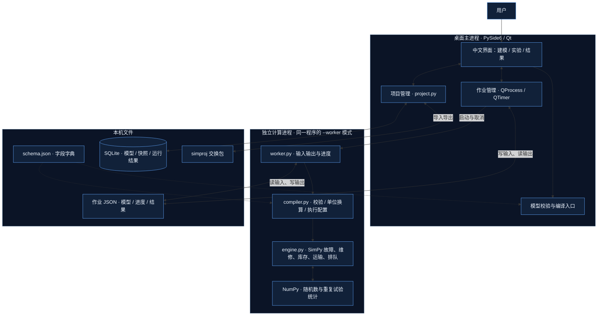
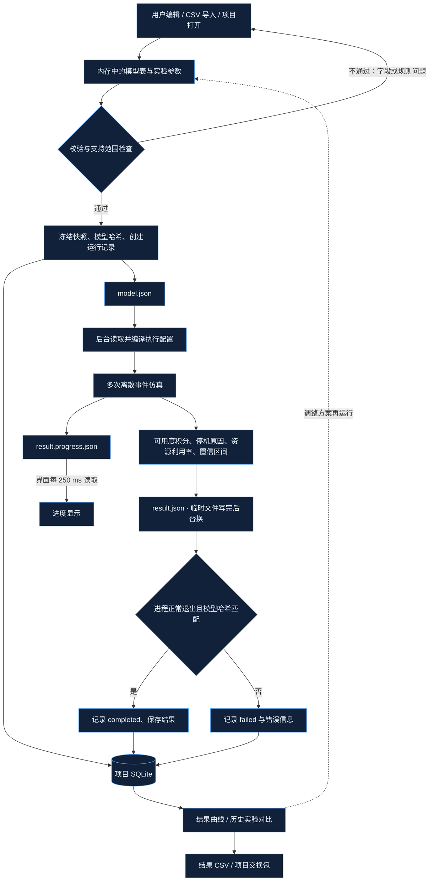

# SimLab 实际软件架构与数据流

2026-09-07，按当前源码核对。界面与后台计算均在本机执行，后台是独立计算进程，没有 HTTP API 或远程服务器。

## 软件架构图

## 数据流图

取消是额外的控制流：用户点击取消 → QProcess.kill → 主进程记录 cancelled 并保存，不产生完成结果。后台异常也会生成错误日志。两个图描述当前实现，不把未来的任务调度、优化或云端服务画成现成功能。

## 可执行证据

- 2026-09-07 本次核心测试：`14 passed in 0.84s`。
- 当前 Windows 可执行版端到端检查：八项 passed，退出码 0。
- 证据文件：`build/qa-architecture-check/smoke-result.json`。
- 合成示例重复 10 次，计算可用度为 `0.9596487296178109`；这不是实际装备指标。
- 调用入口：`simlab/ui/window.py:start_run` → `main.py --worker` → `simlab/worker.py:main` → `simlab/engine.py:simulate`。

能力边界：字段可编辑不代表全部规则可仿真。当前支持基础故障、维修、库存、运输和资源排队；多层维修结构、任务调度、冗余和自动优化尚未实现。
